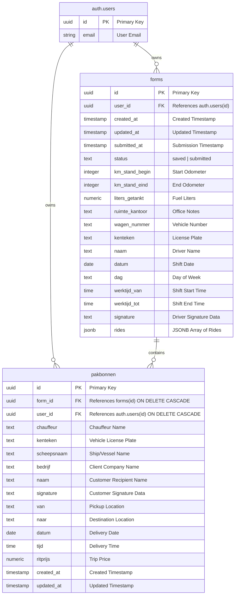

# Taxi Livo - Supabase Database Schema Documentation

This document describes the Supabase database schema for the **Taxi Livo** application. It serves as the official reference for backend data structures and relationships.

---

## 1. Entity Relationship Overview

The database uses a simplified, relational approach to manage daily shift logs, rides, and client delivery notes.

---

## 2. Table Definitions

### 2.1 Table: `public.forms`
Stores the header details of a driver's daily shift log (Rittenstaat) along with their rides (ritten) stored in a structured JSONB array.

| Column Name | Database Type | Constraints / Default | Description |
|---|---|---|---|
| `id` | `uuid` | `PRIMARY KEY`, `DEFAULT gen_random_uuid()` | Unique identifier for the shift log. |
| `user_id` | `uuid` | `FOREIGN KEY` (references `auth.users(id)`) | Identifies the authenticated driver. |
| `created_at` | `timestamptz` | `DEFAULT now()` | Record creation timestamp. |
| `updated_at` | `timestamptz` | `DEFAULT now()` | Record modification timestamp. |
| `submitted_at` | `timestamptz` | `NULLABLE` | Timestamp when the shift log was submitted. |
| `status` | `text` | `DEFAULT 'saved'` | Workflow status (`'saved'` or `'submitted'`). |
| `km_stand_begin` | `integer` | `NULLABLE` | Starting odometer reading of the vehicle. |
| `km_stand_eind` | `integer` | `NULLABLE` | Ending odometer reading of the vehicle. |
| `liters_getankt` | `numeric(10,2)`| `NULLABLE` | Quantity of fuel filled (in liters). |
| `ruimte_kantoor` | `text` | `NULLABLE` | Remarks/notes added by the back-office or dispatch. |
| `wagen_nummer` | `text` | `NULLABLE` | ID or number of the taxi vehicle. |
| `kenteken` | `text` | `NULLABLE` | Vehicle license plate number. |
| `naam` | `text` | `NULLABLE` | Full name of the driver. |
| `datum` | `date` | `NULLABLE` | Date of the shift. |
| `dag` | `text` | `NULLABLE` | Day of the week. |
| `werktijd_van` | `time` | `NULLABLE` | Start time of the shift. |
| `werktijd_tot` | `time` | `NULLABLE` | End time of the shift. |
| `signature` | `text` | `NULLABLE` | Driver signature image (stored as base64 data URL). |
| `rides` | `jsonb` | `DEFAULT '[]'::jsonb` | JSON list storing individual ride logs of the shift. |

---

### 2.2 Table: `public.pakbonnen`
Stores signed delivery notes (vouchers) for cargo or corporate account client rides.

| Column Name | Database Type | Constraints / Default | Description |
|---|---|---|---|
| `id` | `uuid` | `PRIMARY KEY`, `DEFAULT gen_random_uuid()` | Unique identifier for the delivery note. |
| `form_id` | `uuid` | `FOREIGN KEY` (references `public.forms(id)` `ON DELETE CASCADE`) | Link to the parent shift log. |
| `user_id` | `uuid` | `FOREIGN KEY` (references `auth.users(id)` `ON DELETE CASCADE`) | Driver owner ID for row security context. |
| `chauffeur` | `text` | `NULLABLE` | Driver's name on the note. |
| `kenteken` | `text` | `NULLABLE` | Vehicle license plate. |
| `scheepsnaam` | `text` | `NULLABLE` | Ship/vessel name. |
| `bedrijf` | `text` | `NULLABLE` | Client company name. |
| `naam` | `text` | `NULLABLE` | Customer recipient name. |
| `signature` | `text` | `NULLABLE` | Recipient signature image (base64 data URL). |
| `van` | `text` | `NULLABLE` | Pickup location address. |
| `naar` | `text` | `NULLABLE` | Dropoff destination address. |
| `datum` | `date` | `NULLABLE` | Date of the delivery ride. |
| `tijd` | `time` | `NULLABLE` | Time of the delivery ride. |
| `ritprijs` | `numeric(10,2)`| `DEFAULT 0.00` | Agreed price for the ride. |
| `created_at` | `timestamptz` | `DEFAULT now()` | Record creation timestamp. |
| `updated_at` | `timestamptz` | `DEFAULT now()` | Record modification timestamp. |

---

## 3. Data Relationships

* **One-to-Many Relationship (`forms` ──< `pakbonnen`)**:
  * A single daily shift sheet (`forms` record) represents a collection of work completed. A driver can create **zero, one, or multiple** cargo delivery notes (`pakbonnen` records) linked to that daily shift.
  * Each delivery note (`pakbonnen` record) references exactly **one** parent shift record via `form_id`.
* **Referential Integrity**:
  * The link uses a foreign key constraint. If a parent shift log is permanently deleted, the database automatically performs a cascade delete (`ON DELETE CASCADE`) to remove all associated `pakbonnen` records, preventing orphaned database records.
* **Security & Row Ownership (`user_id`)**:
  * Both tables store a `user_id` pointing directly to the driver's auth credential. This design ensures that row-level checks do not require expensive cross-table joins, speeding up Supabase performance.
